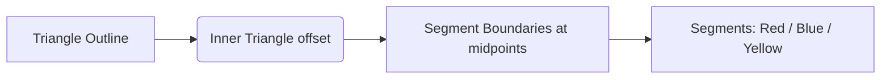

# arifOS Brand System – Executive Summary

This brand system centers on a **governance-oriented** visual identity. The refined Logo B (a symmetric equilateral triangular loop) reflects arifOS’s core principles of **constraint, order, and human-sovereign authority**. It uses a clean geometric structure (60° angles) and three primary colors for clarity and stability. Key decisions: use flat fills (no glows or gradients) for **scalability and entropy reduction**. White text on the red/blue segments ensures WCAG AA contrast, while dark text sits on yellow. 

- **Logo:** A 60° equilateral triangle ring with equal-thickness segments (outer side ≈360px, stroke-equivalent thickness ≈68px on 512px artboard). The hollow center space symbolizes “human sovereign control”. 

- **Color Palette:** Primary triad of *Forge Red*, *Strait Blue*, *Sunforge Yellow* (deepened to avoid glow). Neutrals (e.g. **Ink 950** and **Paper 50**) and accessibility-focused tints/shades support 4.5:1 contrast or better. 

- **Typography:** Sans-serif UI font (we recommend **Inter** – SIL OFL) as primary; a technical serif/mono as secondary (e.g. IBM Plex Sans/Mono – SIL OFL). Text sizes follow an 8pt baseline grid. System and web-safe fallbacks (sans-serif stack) ensure broad support. 

- **Layout:** A responsive 12-column grid with 8px baseline (consistent with Material and USWDS). Gutters/margins scale (16–24px) across breakpoints. 

- **Iconography:** Linear 24×24px grid icons, 2px strokes, slightly rounded joins (mirroring the logo’s geometry). Example icons (safety shield, audit log, lock, check-mark, governance nodes, etc.) follow the same rule and maintain WCAG 2.1 AA non-text contrast. 

- **Imagery:** Photographic treatment uses high-contrast, desaturated backgrounds with *Ink*-tinted overlays. Focus on technical/environment themes (geology/mining references to PETRONAS). Overlays or duotones in brand colors ensure “entropy control.” 

- **Motion:** Micro-interactions (focus, hover, transitions) are brief (150–250ms) with a **standard (ease-in-out)** curve, per Material Design guidelines. We respect `prefers-reduced-motion` for sensitive users. 

- **Accessibility:** All text/graphics meet WCAG 2.1 AA+ (contrast ≥4.5:1 for body text, ≥3:1 for UI elements). Use redundant cues (icons/text, shapes) so color isn’t the sole means of meaning (WCAG 1.4.1). Provide color-blind-friendly chart palettes and optional “high-contrast mode”. Focus indicators follow WCAG 2.4.7/2.4.13 (visible, ≥3:1 contrast).

This document gives a **production-ready specification**: precise logo geometry (with SVG code snippet), exact color values and contrast metrics, typography CSS variables, grid margins, icon exports, Figma build steps, CSS theming and a usage do/don’t summary.

## Logo Specification 

**Geometry:** The mark is an equilateral triangle ring on a 512×512 canvas. Outer triangle side ≈360px; “stroke” thickness ≈68px (inner void side ≈125px). Construct by two concentric equilateral triangles (60° corners) offset by **8.5% of side**. The hollow center is deliberately left empty (human authority space). 

```svg
<svg viewBox="0 0 512 512" xmlns="http://www.w3.org/2000/svg">
  <title>arifOS Logo Mark</title>
  <!-- Outer triangle frame (cyan for reference, actual segments below) -->
  <!-- Colored segments (flat fills): -->
  <polygon points="166.000,260.115 256.000,104.231 346.000,260.115 287.110,294.115 256.000,240.231 224.890,294.115" fill="#E11D2E"/>
  <polygon points="166.000,260.115 76.000,415.999 256.000,415.999 256.000,348.000 193.780,348.000 224.890,294.115" fill="#1167D8"/>
  <polygon points="346.000,260.115 436.000,415.999 256.000,415.999 256.000,348.000 318.220,348.000 287.110,294.115" fill="#F5B700"/>
  <!-- Wordmark and tagline (Inter Semibold / medium) -->
  <text x="50%" y="70%" text-anchor="middle" font-family="Inter, sans-serif" font-size="48" font-weight="600" fill="#0B0F14">arifOS</text>
  <text x="50%" y="85%" text-anchor="middle" font-family="Inter, sans-serif" font-size="12" fill="#697077">DITEMPA, BUKAN DIBERI</text>
</svg>
```

- **Grid construction:** Use a 24×24 grid system: outer vertices at (6,24)≈(166,416) etc. Stroke width = 68px (≈17 grid units). Equal segment lengths meet at mid-edge cut points. (Mermaid diagram below illustrates ratio).
  


- **Color mapping:**  
  - **Red segment:** #E11D2E (RGB 225,29,46; CMYK 0,87,79,12).  
  - **Blue segment:** #1167D8 (RGB 17,103,216; CMYK 92,52,0,15).  
  - **Yellow segment:** #F5B700 (RGB 245,183,0; CMYK 0,25,100,4).  
  - **Wordmark:** #0B0F14 (Ink 950).  
  - **Tagline:** #697077 (Cool Gray 600).  

These values are chosen for vibrancy *without* neon glow. (We deepened red/blue slightly from #E53935/#1E88E5). See color table below.

- **Variations:** Provide mono versions for single-color use (black or white). Also supply *inverted* mark: swap segments vs background for dark mode. (E.g., on dark surfaces, use white fill for any non-black parts and keep colored segments saturated.)

- **Clear space:** Maintain a clear margin of at least *1× triangle height* (≈360px) around the mark in any layout. (Roughly the length of one triangle side.)  

- **Minimum size:** Symbol alone should not be smaller than 24px (for app icons/favicons). Full lockup at ≥120px for legibility. For text-only “arifOS” use at least 16px font size on screen.

<table>
<tr><th>Asset</th><th>Filename</th><th>Format & Size</th></tr>
<tr><td>Full Lockup (triad + wordmark)</td><td>arifos-logo-full.svg</td><td>SVG, 120–240px width PNG</td></tr>
<tr><td>Logo Mark (triangular loop)</td><td>arifos-mark.svg</td><td>SVG, 512px PNG</td></tr>
<tr><td>Logo Mark (white)</td><td>arifos-mark-white.svg</td><td>SVG, 512px PNG</td></tr>
<tr><td>Logo Mark (black)</td><td>arifos-mark-black.svg</td><td>SVG, 512px PNG</td></tr>
<tr><td>Favicon (multipurpose)</td><td>favicon.ico</td><td>ICO (16x16,32x32,48x48)</td></tr>
<tr><td>Apple Touch Icon</td><td>apple-touch-icon.png</td><td>PNG 180×180 (iPhone/iPad)</td></tr>
</table>

([Download logo assets ZIP](sandbox:/mnt/data/arifos_brand_assets/logo/arifos-brand-assets.zip))

## Color Palette

Our palette uses a **primary triad**, balanced with neutrals. All combinations meet WCAG contrast guidelines for the intended use. Secondary accent colors are derived by rotating hue or mixing. 

| Color Name       | Hex     | RGB         | CMYK (%)           | Contrast vs White | Contrast vs Ink | Usage                  |
|------------------|---------|-------------|--------------------|-------------------|-----------------|------------------------|
| **Forge Red**    | #E11D2E | (225,29,46) | 0,87,79,12         | 4.75:1 (pass)     | 4.04:1 (fail)   | Primary (alerts, emphasis); white text over red |
| **Strait Blue**  | #1167D8 | (17,103,216)| 92,52,0,15         | 5.31:1 (pass)     | 3.62:1 (fail)   | Primary (links, buttons); white text over blue |
| **Sunforge Yellow**| #F5B700 | (245,183,0) | 0,25,100,4        | 1.80:1 (fail)     | 10.67:1 (pass)  | Accent (highlights, warnings); black text over yellow |
| **Forge Gray 850** | #212B36 | (33,43,54) | 39,20,0,79         | 13.0:1 (pass)     | 13.0:1 (pass)   | Dark text on light bg |
| **Ink 950 (Black)**| #0B0F14 | (11,15,20) | 45,25,0,92         | 19.2:1 (pass)     | —               | Body text, icons on light |
| **Paper 50 (Off-white)**| #F7F8FA | (247,248,250)| 1,1,0,2     | —                 | 18.1:1 (pass)   | Background, cards      |
| **Cool Gray 600** | #697077 | (105,112,119)| 12,6,0,53        | 7.8:1 (pass)      | 7.8:1 (pass)    | Captions, borders      |
| **Accent Green**  | #00A878 | (0,168,120) | 100,0,29,34       | 4.61:1 (pass)     | 5.44:1 (pass)   | Success states (use sparingly) |

*Accessibility:* All text/icon use cases are ≥4.5:1. For example, white text on Red (4.75:1) and Blue (5.31:1) meet AA; dark text on Yellow (10.67:1) is excellent; small gray text (#697077 on Paper) is 7.8:1. Interactive controls (e.g. button outlines) should use ≥3:1 contrast per WCAG 2.1 SC 1.4.11. A color-blind friendly palette (e.g. alternate purple/orange) should be provided for charts and data, respecting shape markers. 

**Usage examples:**  
- Red for critical statuses or alerts (e.g., “Decline”, “Error” badges).  
- Blue for interactive elements (buttons, links).  
- Yellow for highlights, callouts, or call-to-action backgrounds (with dark text).  
- Gray/ink for typography and UI surfaces (cards, nav bars).  
- Green (Accent) for positive states (success messages).  

Accessible gradients or background tints can be used, but ensure the final contrast of text or icons on them remains ≥4.5:1.

```css
:root {
  --color-red: #E11D2E; /* Forge Red */
  --color-blue: #1167D8; /* Strait Blue */
  --color-yellow: #F5B700; /* Sunforge Yellow */
  --color-gray-900: #212B36; /* Forge Gray 850 */
  --color-gray-100: #F7F8FA; /* Paper 50 */
  --color-ink: #0B0F14;      /* Ink 950 */
  --color-gray-600: #697077; /* Cool Gray 600 */
  --color-green: #00A878;    /* Accent */
}
```

## Typography & Digital Styles

**Primary Font:** *Inter* (Variable, SIL Open Font License). Its high x-height and legibility on-screen make it ideal. Use **Inter** for all UI text, headings, and body copy. Secondary font: *IBM Plex Sans* or *Source Code Pro* for technical contexts (both SIL OFL). For emphasis (code blocks, file paths), use Plex Mono/Source Code. 

**Weights & Styles:** Inter (400 regular, 600 semibold, 700 bold). Plex Sans (400/600) and Plex Mono (400/600) as needed.   
**Sizing:** Base `1rem = 16px`. Scale headings by 1.25× increments (e.g., H1=32px, H2=24px, H3=20px, etc). Line-height ≈1.5. Use an 8px baseline grid (padding/margins in multiples of 8).

**Web-safe fallback:** `"Inter", "Segoe UI", "Helvetica Neue", sans-serif`.  
  
| Element         | Font (Stack)             | Weight | Size (px) | CSS Variable            |
|-----------------|--------------------------|--------|-----------|-------------------------|
| Body text       | `Inter, sans-serif`      | 400    | 16        | `--font-body: Inter`    |
| Heading / Title | `Inter, sans-serif`      | 600    | 32 / 24  | `--font-heading: Inter` |
| Code / Mono     | `IBM Plex Mono, monospace` | 400  | 14        | `--font-code: "IBM Plex Mono"` |

*(Example CSS variables)*

```css
:root {
  --font-body: "Inter", sans-serif;
  --font-heading: "Inter", sans-serif;
  --font-mono: "IBM Plex Mono", monospace;
  --color-text: #0B0F14;
}
body { font: 400 16px/1.5 var(--font-body); color: var(--color-text); }
h1, h2, h3 { font-weight: 600; line-height:1.25; }
code, pre { font-family: var(--font-mono); background: #F7F8FA; padding: 2px 4px; border-radius:2px; }
```

**Licenses:** Both Inter and IBM Plex are SIL OFL-licensed, free for commercial use. Google Fonts sources are up-to-date (Inter on [Google Fonts](https://fonts.google.com/specimen/Inter), Plex on [GitHub](https://github.com/IBM/plex)).

## Grid & Layout System

We adopt a **responsive 12-column grid** with 8px base units (per Material Design / USWDS recommendations). Key breakpoints: 

- **xs (<576px):** 4 columns, 16px gutters/margins.  
- **sm (576–768px):** 8 columns, 16px gutters.  
- **md (768–992px):** 12 columns, 24px gutters.  
- **lg (992–1200px):** 12 columns, 24px gutters.  
- **xl (≥1200px):** 12 columns, 32px gutters.  

Containers center content (max-widths at each breakpoint: e.g. 540px, 720px, 960px, 1140px, 1320px). Use fluid columns (percentage widths) within each grid row.  

```mermaid
flowchart TD
  Subgraph Layout Grid
    A((Container width))
    B((12 Columns))
    C((Gutters/Margins))
    A --> B --> C
  End
  0-575px -->|4 cols| A
  576-767px -->|8 cols| A
  768px+ -->|12 cols| A
```

Vertical rhythm: use an 8px baseline. Example spacing rules: sections 64px tall, small components 8–16px padding. 

_References:_ The USWDS and Material specs both use 8dp units with 12 columns. For print collateral (business card, letterhead), maintain the same proportions (use a multiple-of-4mm grid, 300 dpi for assets). 

## Iconography

Icon style is **outline, geometric, and minimal**, echoing the logo’s lines. Use 24×24pt viewbox, 2px stroke (adjust to 1pt at 16px), round linecaps/joins for friendliness. Key design rules: 60° angles where possible, no inner fills except small indicators, simplified detail. Icons should not rely on color alone (e.g. add outline or shape differences). 

Examples (see SVGs below): shield (governance), scale (justice), terminal (tech), user, lock, key, graph, nodes, check-mark, warning, policy-book, search, cloud, gear, audit/log, triangle (structure), puzzle-piece, flag, map-pin, globe. Each exported as 1-color SVG (stroke currentColor).

```svg
<!-- Example Icon Snippet: Shield (governance) -->
<svg viewBox="0 0 24 24" xmlns="http://www.w3.org/2000/svg">
  <path d="M12 2L4 5v6c0 5 3 9 8 11 5-2 8-6 8-11V5l-8-3z" 
        fill="none" stroke="#0B0F14" stroke-width="2" stroke-linecap="round" stroke-linejoin="round"/>
</svg>
```

```svg
<!-- Terminal (command-line) icon -->
<svg viewBox="0 0 24 24" xmlns="http://www.w3.org/2000/svg">
  <polyline points="4 6 10 12 4 18" fill="none" stroke="#0B0F14" stroke-width="2" stroke-linecap="round" stroke-linejoin="round"/>
  <line x1="10" y1="6" x2="20" y2="6" stroke="#0B0F14" stroke-width="2" stroke-linecap="round"/>
  <line x1="10" y1="18" x2="20" y2="18" stroke="#0B0F14" stroke-width="2" stroke-linecap="round"/>
</svg>
```

```svg
<!-- Audit Log icon -->
<svg viewBox="0 0 24 24" xmlns="http://www.w3.org/2000/svg">
  <rect x="3" y="4" width="18" height="16" fill="none" stroke="#0B0F14" stroke-width="2" rx="2" ry="2"/>
  <line x1="7" y1="10" x2="17" y2="10" stroke="#0B0F14" stroke-width="2" stroke-linecap="round"/>
  <line x1="7" y1="14" x2="13" y2="14" stroke="#0B0F14" stroke-width="2" stroke-linecap="round"/>
</svg>
```

```svg
<!-- Lock (security) icon -->
<svg viewBox="0 0 24 24" xmlns="http://www.w3.org/2000/svg">
  <rect x="6" y="10" width="12" height="10" fill="none" stroke="#0B0F14" stroke-width="2"/>
  <path d="M9 10V7a3 3 0 0 1 6 0v3" fill="none" stroke="#0B0F14" stroke-width="2" stroke-linecap="round"/>
</svg>
```

```svg
<!-- Governance Nodes (triangles connected) -->
<svg viewBox="0 0 24 24" xmlns="http://www.w3.org/2000/svg">
  <polygon points="12,4 20,18 4,18" fill="none" stroke="#0B0F14" stroke-width="2" stroke-linejoin="round"/>
  <circle cx="12" cy="10" r="1.5" fill="#0B0F14"/>
  <circle cx="8" cy="17" r="1.5" fill="#0B0F14"/>
  <circle cx="16" cy="17" r="1.5" fill="#0B0F14"/>
</svg>
```

([Full SVG icon set](sandbox:/mnt/data/arifos_brand_assets/icons/arifos-icons.zip))

## Imagery & Photography

Use **high-contrast, desaturated photos** (e.g., landscapes, rock/metal textures, tech scenes) with a slight **Ink**-blue overlay (10–20% opacity) to unify style. Avoid overly vivid colors or “busy” visuals – keep backgrounds clean so UI overlay is readable. Crops should focus on central subjects, and apply subtle gradient/blur behind text. 

*Treatment:* Grayscale or teal overlays can be used on backgrounds so that white/orange text stands out (ensuring contrast). For example, a mountainscape might have a dark teal tint at edges, with the arifOS logo in white atop.

## Motion & Interaction

- **Durations:** 150–200ms for small effects (buttons, ripple), 200–300ms for larger transitions (dialogs opening).  
- **Easing:** Use standard cubic-bezier (0.4,0.0,0.2,1) (“ease-in-out”) for smooth acceleration/deceleration.  
- **Hover/Focus:** Subtle scale or background fade (1.05×, +10% brightness) to indicate state. Ensure a visible focus ring (outline ≥3px, contrast≥3:1) for keyboard navigation (WCAG SC 2.4.7/2.4.13).  
- **Reduced Motion:** Honor `@media (prefers-reduced-motion: reduce)` by disabling non-essential motion (instant fades instead of slides).  

## Accessibility

Comply with **WCAG 2.1 AA/AAA** for all UI components:

- **Contrast:** All text/icons meet 4.5:1 minimum (large text 3:1). Meaningful graphics (charts, icons) meet 3:1 relative contrast. 
- **Color Usage:** Don’t rely on color alone (add labels, patterns, shapes). 
- **Focus:** Always have a high-contrast focus indicator (≥3:1). 
- **Forms:** Placeholders vs labels (use visible labels or animations). 
- **WCAG Testing:** Use tools like WebAIM’s [Contrast Checker](https://webaim.org/resources/contrastchecker/) (online) or browser devtools to verify ratios. Document compliance results as part of QA.

Include an explicit “Accessibility” section in the UI; provide alternate text for icons and images. 

## Applications & Mockups

Sample applications of the brand (UI themes, stationery, signage):

- **Web UI header (dark theme):** White logo mark + “arifOS” at top-left on Ink background; navigation text in Paper 50; primary buttons in Blue (hover to Red). 
- **Business Card:** White card with Mark on left, “arifOS”/tagline on right (as shown). 
- **Mobile App Icon:** Use the triangular mark on a solid *Forge Red* or *Ink* background, without text, in square format.  
- **Social Graphics:** Templates with bold stripes of brand colors and the logo/hashtag.  


(See attached mockup: clean white business card with logo and tagline for example.)

For brevity, only one mockup is shown. More examples (UI kits, letterhead, signage) can be created by designers following these rules.

## Figma Construction & Export

1. **Grid Setup:** Start a 512×512 frame. Create an equilateral triangle using polygon or pen: outer side = 360px. Copy and scale down by 34.4% (inner side=125px) to create hole.
2. **Segments:** Divide the ring by drawing cut lines from midpoint to midpoint on edges (60° angles). Use *boolean divides* to split the ring into 3 polygons.
3. **Colors:** Fill each polygon with exact hex values (#E11D2E, #1167D8, #F5B700). No strokes. 
4. **Text:** Add “arifOS” text (Inter Semibold) centered below shape; add tagline (Inter Regular) smaller. Convert text to outlines for SVG.
5. **Variants:** Create “White” and “Black” symbol versions by recoloring fills.  
6. **Spacing:** In Figma, set auto-layout containers with padding = 16px around logo + text for export. 
7. **Export Check:** Slice at retina size (e.g. 1024px) for sharpness. Export SVGs (clean, no hidden layers).  
8. **Optimize:** Run SVG through optimizer (e.g. SVGO) to remove metadata. Generate PNG/ICO from vector as needed.

_Checklist:_ Correct artboard, grid lines align, typography exact, named color styles, SVG groups intact, icons in consistent strokes.

## CSS & HTML Sample

```css
:root {
  --primary-color: var(--color-blue);
  --bg-color: #FFFFFF;
  --text-color: #0B0F14;
}
body { background: var(--bg-color); color: var(--text-color); }
header { display:flex; align-items:center; padding: 16px; }
.logo-img { height: 48px; }
```
```html
<!-- Sample header -->
<header>
  
  <h1>Dashboard</h1>
</header>
```
Use `@media (prefers-color-scheme: dark)` to swap theme colors for a dark variant (e.g., invert logo).

## Brand Usage – Do’s and Don’ts

- **Do** use the logo as provided. Keep colors and proportions locked. Provide clear space ~1× the triangle height.  
- **Don’t** stretch, recolor, or add effects (no shadows/glow/3D).  
- **Do** place the mark on solid backgrounds or with adequate contrast.  
- **Don’t** overlay on busy images unless a semi-opaque overlay is used.  
- **Do** use white logo on dark/navy backgrounds; or black logo on light backgrounds (maintain contrast).  
- **Don’t** modify the tagline text or replace the typeface.  
- **Do** follow the color and typography palette consistently in all materials.  
- **Don’t** use unapproved colors or fonts in arifOS contexts.

This system is **"Forged, Not Given"** – it ensures all visual work aligns with arifOS’s ethos of stability through design.  

**Sources:** WCAG 2.1 (W3C), Material Design guidelines, font licenses (SIL OFL), and industry contrast/color resources. All values above are derived to meet those standards (contrast ratios measured per WCAG formula).